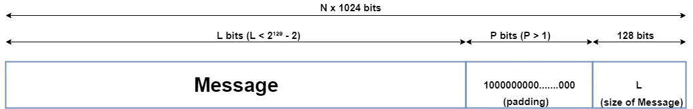
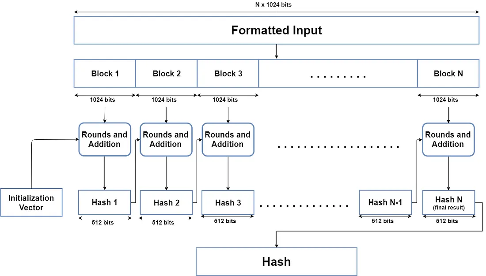
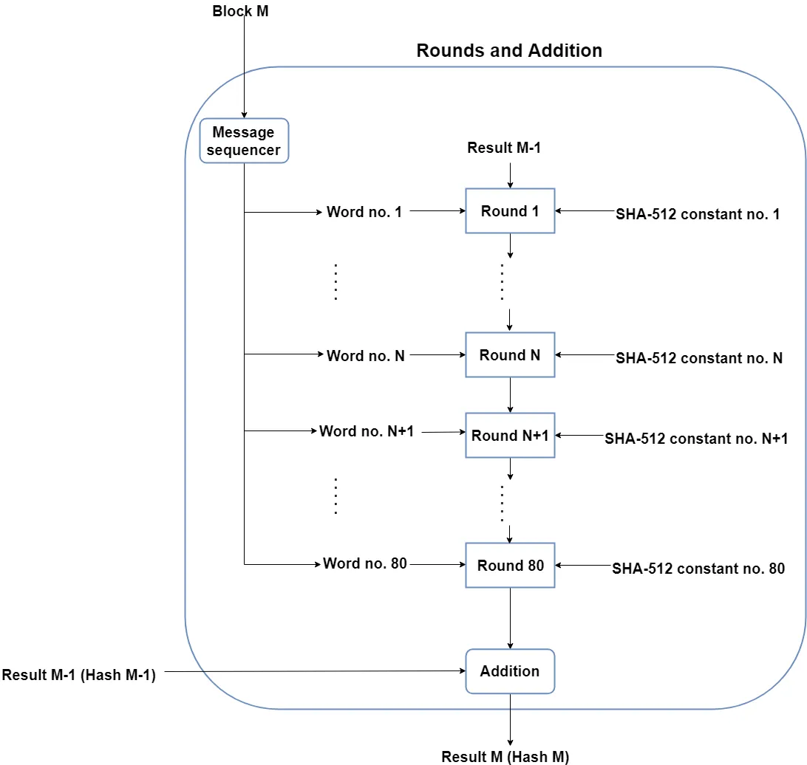

# SHA-512

Presentation by Pranjal Modi and Raymond Zhang

## SHA-512 General Facts

SHA-512 is a hash function that was designed by the National Security Agency (NSA) and published by the National Institute of Standards and Technology (NIST) in 2001 as a Federal Information Processing Standard (FIPS).

SHA-512 helps encode important and sensitive data, like passwords, by turning input (SHA-512 is designed for input messages of up to $`2^{128} - 2`$ bits, which will be explained later) into hash digests. The algorithm is commonly used for email addresses, passwords, and digital record verification, but it is also used in blockchain technology. The hash digests have a fixed length of 512 bits, or 64 bytes. In the case of SHA-512, a 512-bit hash is created; compared to its predecessor SHA-256 which only creates hashes of 256 bits (32 bytes), SHA-512 is more secure. 

The strengths of SHA-512 include:

* **Resistance to many cryptographic attacks**

  For each of the 128 characters in the output of a SHA-512 hash digest, there are 16 possible characters (0-9 and a-f). 
  This yields $`16^{128} \approx 1.34 * 10^{154}`$ possibilities. This vastly reduces the chance of collisions occuring (when two different inputs generate the same output).

* **Irreversible**

  Modular addition and bitwise rotation ensure that a hash digest cannot be traced back to the original message (without a rainbow table). 

* **Iterative Structure**

  Multiple rounds of processing (80, to be precise) that use specific mathematical functions amplify the *diffusion* and *avalanche* effects. This means that small changes in an input will generate completely different hashes.

* **Versatile** 

  Not only can SHA-512 be used for cryptography, it can also be used in many other information security and data management fields, like checksum verifications as well as checks for data integrity. 

## Algorithm

### Input Formatting

Data is inputted, which must have an input size limit. This means that not all input sizes can be hashed. 

Therefore, the input has to be formatted to the correct size for the algorithm to be performed on it. 

We call this **input formatting**. The whole formatted message has three parts: the original message, padding, and the size of the original message. 

Combined, this should all be a multiple of 1024 bits. 

The reason for this is because the formatted message will be processed as blocks of 1024 bits each. 

#### Padding

Padding is pretty simple! Taking the original input message, some padding bits are appended. These bits are just '0' bits with a leading '1' bit. By the way, padding needs to be done, even if there is only one bit of padding (just the '1').

#### Size of Original Message

After the padding bits, the size of the original message needs to be formatted into the input. The size value is represented by the last 128 bits of each block. This is why there is an input message length limitation. The largest number that can be represented using 128 bits is the value $`2^{128} - 1`$. Because of the necessary padding bit, the actual maximum size would be reduced to $`2^{128} - 2`$. Despite this limit, it won't be a problem for a majority of users because of the enormity of the number. 

### Hash Buffer

The algorithm of SHA-512 is designed in such a way that blocks will have to depend on results of previous blocks. 

Hence a *hash buffer* of length 8 (with indexes a, b, c, d, e, f, g, and h) is used to store these intermediate results. The last intermediate result will be used to form the output of the SHA-512 algorithm. 

What about the very first block? What values will that block use, since there's no previous processing to yield hash values?

This problem is easily solved by initializing default values in the hash buffer. The constants in hexadecimal are as follows:

Index | Hexadecimal Value
--- | ---
a | 0x6a09e667f3bcc908
b | 0xbb67ae8584caa73b
c | 0x3c6ef372fe94f82b
d | 0xa54ff53a5f1d36f1
e | 0x510e527fade682d1
f | 0x9b05688c2b3e6c1f
g | 0x1f83d9abfb41bd6b
h | 0x5be0cd19137e2179

**Fun fact!** These values aren't random! If we take the first 8 prime numbers (2, 3, 5, 7, 11, 13, 17, 19), and then square root them, and then take the first 64 bits of each fractional part, we will get these values.

### Message Processing

Now we get to the fun part!

The below diagram is of the entire algorithm at a glance:

The below diagram is of each round in more detail:

As we can see, in each round of the message processing phase, more constants are used. These aren't random, either. Taking the first 64 bits of the cube roots of the first 80 prime numbers, we get these values.

### SHA-512 Output

After all the blocks goes through the algorithm, we are left with a final 512 bit hash digest which will be our output. 

### Sources

[General Facts link][https://komodoplatform.com/en/academy/sha-512/#:~:text=SHA%2D512%2C%20or%20Secure%20Hash,hashing%2C%20and%20digital%20record%20verification.]

[Medium article we used for the Algorithm][https://medium.com/@zaid960928/cryptography-explaining-sha-512-ad896365a0c1]

[Link to the Java implementation of SHA-512 that we used to help debug (trittimo)][https://github.com/trittimo/SHA512]

